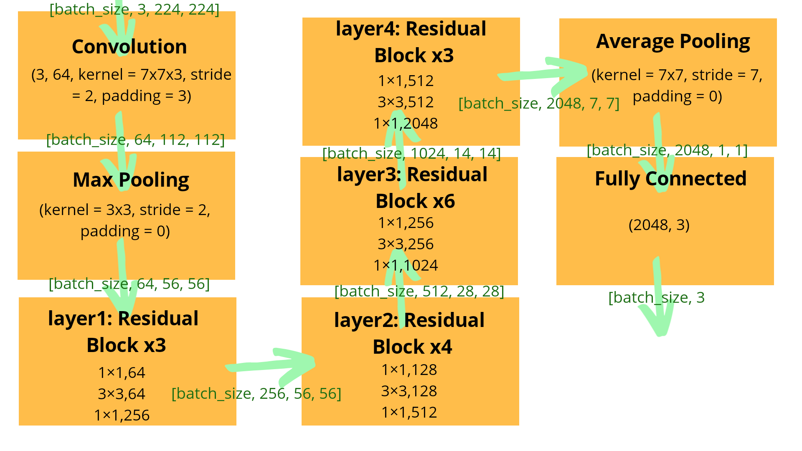
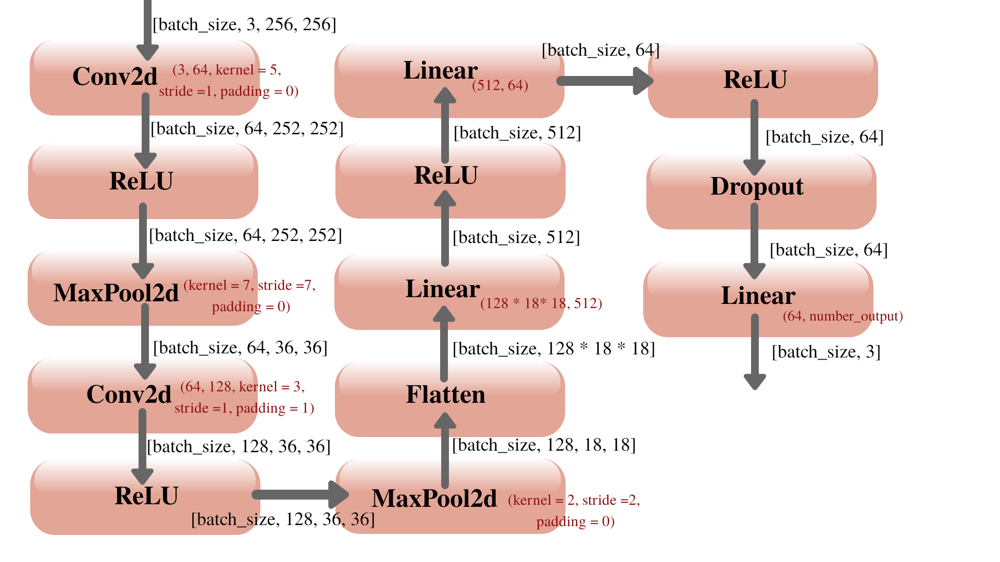

# face_mask_detection

**The Goal of Project**

The main goal of the project is building a CNN model from scratch and implementing transfer learning from ResNet50 on the dataset which is collected. After that, classification capabilities from webcam input will be discussed. The dataset mainly based on people wearing mask/not wearing mask/wearing mask wrongly.  

---
**Table of Contents**

* [Brief Introduction](#brief-introduction)
* [Directory structure](#directory-structure)
* [Explaination of project](#explaination-of-project)
* [Usage examples](#usage-examples)
* [Discussion of Results](#discussion-of-results)
* [About Author](#about-author)

---
## Brief Introduction

In this project, 3 main implementation of CNN will be presented. First and second ones are transef learning from ResNet50. The difference between first and second one is fine-tuning. At the first one (which is mentioned as ResNet-not_retrain), transfer learning is applied and only last layer is changed with respect to dataset output classes. The networks parameters are freezed. At the second one (which is mentioned as ResNet_retrain), transfer learning is applied with fine-tuning of weights and biases of last 4 layers(layer3, layer4, avgpool, fc) original pre-trained ResNet50. The  network parametes of last 4 layers are unfreezed. One can see the mentioned layers from the following image or [source code of pytorch ResNet50](https://github.com/pytorch/vision/blob/master/torchvision/models/resnet.py):

  <p align="center">
  
  </p>
  
The input image is given as 224x224. In the input image, 3 comes from RGB image channels. The input image is fed into first convolutional layer, which has 64 output channel, 7x7x3 kernel size, 2 stride and 3 padding. After first convolutional layer, max pooling with 3x3 kernel, 2 stride is applied. Then, 4 residual blocks is processed. First layer/residual block that consists of convolutional layers. The details of output channel and kernel size of these convolutional layers can be seen on the above figure. 

  
At the third and the last one, CNN from scratch (which is mentioned as BasicCNN) is implemented. The structure of BasicCNN can be seen from the following image:

  <p align="center">
  
  </p>
  
The input image of 3x256x256 is fed into the first convolutional layer, which has 64 output channels, 5x5 kernel, 1 stride and 0 padding. This result is passed through ReLU function and max pooling layer with 7x7 kernel, 7 stride and 0 padding. One more convolutional, ReLU and max pooling layers are applied with different kernel size, stride and padding. At the end of max pooling, flatten operation is applied to change the dimensions. In order to get more convenient results 2 linear and ReLU operations are applied sequentially. After that, dropout is used to get better results. Finally, with linear layer, softmax activation function is used to obtain output classes. 


The dataset of the project cannot be shared on github due to privacy issues. The dataset consists of 3 classes. Each class and its number of data follow as:
* Mask: 343
* No_mask: 304
* Wrong_mask: 400

The dataset is collected from friends and family members. However, the dataset structure is showed on the directory structure part. In order to evaluate the performance of third(wrong_mask) class, several test runs completed with and without third class. Due to the simplicity for saving the results of traning and classification results, there are two different dataset directory for 2 and 3 classes cases.

---
## Directory structure
```
.
├── dataset_2_classes
│   ├── labeled
│   │   ├── mask
│   │   ├── no_mask
│   ├── unlabeled
├── dataset_3_classes
│   ├── labeled
│   │   ├── mask
│   │   ├── no_mask
│   │   ├── wrong_mask
│   ├── unlabeled
├── demo_gifs
│   ├── ResNet-not_retrain-3classes-64-60-0.00100000.gif
│   ├── ResNet-retrain-2classes-64-60-0.00010000.gif
│   ├── ResNet-retrain-3classes-64-60-0.00010000.gif
├── images
│   ├── BasicCNN.png
│   ├── ResNet50.png
├── models
│   ├── BasicCNN-not_retrain-2classes-64-60-0.00010000.pth
│   ├── BasicCNN-not_retrain-2classes-64-60-0.00100000.pth
│   ├── BasicCNN-not_retrain-3classes-64-60-0.00010000.pth
│   ├── BasicCNN-not_retrain-3classes-64-60-0.00100000.pth
│   ├── ResNet-not_retrain-2classes-64-60-0.00010000.pth
│   ├── ResNet-not_retrain-2classes-64-60-0.00100000.pth
│   ├── ResNet-not_retrain-3classes-64-60-0.00010000.pth
│   ├── ResNet-not_retrain-3classes-64-60-0.00100000.pth
│   ├── ResNet-retrain-2classes-64-60-0.00010000.pth
│   ├── ResNet-retrain-2classes-64-60-0.00100000.pth
│   ├── ResNet-retrain-3classes-64-60-0.00010000.pth
│   ├── ResNet-retrain-3classes-64-60-0.00100000.pth
├── packages
│   ├── __init__.py
│   ├── dataset.py
│   ├── network.py
│   └── utils.py
└── results
│   ├── BasicCNN-not_retrain-2classes-64-60-0.00010000.png
│   ├── BasicCNN-not_retrain-2classes-64-60-0.00100000.png
│   ├── BasicCNN-not_retrain-3classes-64-60-0.00010000.png
│   ├── BasicCNN-not_retrain-3classes-64-60-0.00100000.png
│   ├── ResNet-not_retrain-2classes-64-60-0.00010000.png
│   ├── ResNet-not_retrain-2classes-64-60-0.00100000.png
│   ├── ResNet-not_retrain-3classes-64-60-0.00010000.png
│   ├── ResNet-not_retrain-3classes-64-60-0.00100000.png
│   ├── ResNet-retrain-2classes-64-60-0.00010000.png
│   ├── ResNet-retrain-2classes-64-60-0.00100000.png
│   ├── ResNet-retrain-3classes-64-60-0.00010000.png
│   ├── ResNet-retrain-3classes-64-60-0.00100000.png
├── __init__.py
├── face_mask_detector.py
├── haarcascade_frontalface_default.xml
├── LICENSE
├── README.md
├── requirements.txt
├── Terminal Command Run Examples.txt
```

---
## Explaination of project

The project can be divided into 2 main parts.
* Training the Network
* Classifying the Webcam Image
In order to compile the code, [face_mask_detector](https://github.com/singultek/face_mask_detection/blob/main/face_mask_detector.py) main method should be used. For detailed usage options, please check the usage examples part. face_mask_detector imports [packages.utils](https://github.com/singultek/face_mask_detection/blob/main/packages/utils.py), thus it can parse the command line arguments and call the proper method from packages.utils (Ex. face_mask_detector can call packages.utils.training if the train working mode is selected). 
---

### Training the Network

This part is responsible for getting the dataset, initializing the CNN models and training the 2 different dataset option with 3 different CNN models. The getting dataset is mostly computed with [packages.dataset](https://github.com/singultek/face_mask_detection/blob/main/packages/dataset.py). Inside this package, one can see the packages.dataset.Dataset() class, which is inherited from [torch.utils.data.Dataset](https://pytorch.org/docs/1.6.0/data.html?highlight=torch%20utils%20data%20dataset#torch.utils.data.Dataset). The methods of packages.dataset.Dataset() are as following:

1. `__init__()`: Class constructer
  * Checks the given dataset path
  * Load the data if the (empty_dataset = False) or leave the dataset empty if (empty_dataset = True)
2. `__len__()`: The lenght method
  * Returns the lenght of dataset
3. `__getitem__()`: The item selection method
  * Gets the index of item from dataset and returns to tuple of (image, label) precise image
  * It performs preprocessing operations onto selected data
  * Converts label of data into torch.tensor
4. `preprocess_operation()`: The data preprocessing method
  * Gets the data and declares the preprocessing operations for data 
5. `split_into_test_train()`: The creating split of dataset method
  * Gets the desired proportion lists and checks it whether it is proper or not (Ex. sum of proportions should be equal to 1)
  * Creates train, validation and test data splits for each labeled class(mask, no_mask, wrong_mask)
6. `data_loader()`: The data loader method
  * Packs data in terms of iterable dataset with the help of [torch.utils.data.DataLoader](https://pytorch.org/docs/1.6.0/data.html?highlight=torch%20utils%20data%20dataset#torch.utils.data.DataLoader) 
  * Uses batch_size attribute to decide how many data sample will be loaded per batch
  * Uses shuffle attribute to decide whether data will be reshuffle after each epoch or not
  * Uses number_workers attribute to select how many number of subprocessor will be used to load the data
7. `summary_data_characteristics()`: The printing summary method
  * Prints the number of samples, labels of classes, informations of proportions, encoding of classes and data distributions over the classes
  
 Initialization of CNN models is computed by [packages.network](https://github.com/singultek/face_mask_detection/blob/main/packages/network.py). Inside this package, there exists packages.network.CNNClassifier() class, that is highly inherited from [torch.nn.Module](https://pytorch.org/docs/1.6.0/generated/torch.nn.Module.html?highlight=torch%20nn%20module#torch.nn.Module). The included methods can be seen as following:
 1. `__init__()`: Class constructer
  * Checks the given backbone and resnet_retrain_mode attributes to define the network model from 3 different options
  * Defines the data preprocessing options by using [torchvision.transforms.Compose](https://pytorch.org/docs/1.6.0/torchvision/transforms.html?highlight=transforms#torchvision.transforms.Compose)
  * Moves selected network model to given device attribute
 2. `save()`: The saving method
  * Saves the network model parameters onto given network_path attributes
 3. `load()`: The loading method
  * Loads the network model parameters onto given network_path attributes
  * Moves the network model to device
 4. `forward()`: The forward stage method
  * Creates computational graph (implicity in the torch module)
  * Computes outputs before activation function, which are called logits
  * Applies softmax activation function ([torch.nn.functional.softmax](https://pytorch.org/docs/1.6.0/nn.functional.html?highlight=torch%20nn%20functional%20softmax#torch.nn.functional.softmax)) to logits to compute outputs of forward stage
 5. `__decision()`: (_static method_) The decision method
  * Applies argmax operation([torch.argmax](https://pytorch.org/docs/1.6.0/generated/torch.argmax.html?highlight=torch%20argmax#torch.argmax)) to select winning class ID (maximum valued output)
 6. `__loss()`: (_static method_) The loss method
  * Computes the Cross Entropy loss function by using [torch.nn.functional.cross_entropy](https://pytorch.org/docs/1.6.0/nn.functional.html?highlight=torch%20nn%20functional%20cross_entropy#torch.nn.functional.cross_entropy)
 7. `__performance()`: (_static method_) The performancce method
  * Checks the decisions and labels to compute network accuracy
 8. `__plot()`: (_static method_) The plot method
  * Plots and saves the train and validation accuracies over the each epoch 
 9. `train_network()`: The training procedure method
  * Uses the ADAM optimizer ([torch.optim.Adam](https://pytorch.org/docs/1.6.0/optim.html?highlight=torch%20optim%20adam#torch.optim.Adam))
  * For each epoch, 
    * Gets the data from data loader
    * Moves that data to device
    * Applies forward method to each mini-batch
    * Applies loss and resets the stored gradient (zero_grad()) in order to store gradients computed from backward
    * Applies ADAM optimizer by using step() to update weights
    * With turning off the keeping track of gradients (no_grad()), evaluate the mini-batch performance 
  * Accumulates the loss and accuracies through network
  * Save the best performed network and plot network's performance
 10. `eval_network()`: The evaluating procedure method
  * Evaluates the accuracy over each mini-batch
  * Accumulate mini-batch accuracies through the network and find network accuracy
 11. `classify_input()`: The classification method
  * Sets the evaluation mode on and not keep track of gradients (no_grad())
  * Moves input_image data to device 
  * Computes the outputs of network
---

### Classifying the Webcam Image

In this step, the classification process on the input webcam image will be performed. Computing classification is based on [packages.utils](https://github.com/singultek/face_mask_detection/blob/main/packages/utils.py). Inside that package, there are several methods:
1. `webcam_capture()`: The webcam capture and classification method
  * Captures the webcam image 
  * Creates the classifier object and loads network_path
  * Applies face detection by using Haar Cascade ([haarcascade_frontalface_default.xml](https://github.com/singultek/face_mask_detection/blob/main/haarcascade_frontalface_default.xml))
  * For each detected face image,
    * Converts image to PIL Image
    * Performs data preprocessing on the image
    * Classify this image with packages.network.CNNClassifier.classify_input() method
    * Takes the prediction, and calculates the confidence 
    * Put text and color indicators on the webcam image frame to state the prediction of network
2. `parse_arguments()`: The parsing command line arguments method
  * Parses the command line arguments to enhance user interface
3. `training()`: The main training method
  * Creates dataset and classifier object and organize the steps of training procedure 
4. `evaluating()`: The main evaluation method
  * Creates dataset and classifier object and organize the steps of evaluation procedure 
5. `classifying()`: The main classifying method
  * Gets network_path to be used during classification procedure 
  * Calls the webcam_capture, which takes care of organization of the webcam capture and network classification over captured image

---
## Usage examples

The main [face_mask_detector](https://github.com/singultek/face_mask_detection/blob/main/face_mask_detector.py) code can run in three working modes: training, evaluating, classifying. Following help commands and usage examples can be followed to run the code from command line:


### Training

In order to see the help for train mode, one can run following on the command line:
`$ python3 face_mask_detector.py train -h`

```
usage: face_mask_detector.py train [-h] [--backbone {ResNet,BasicCNN}] [--resnet_retrain_mode {not_retrain,retrain}]
                                   [--batch_size BATCH_SIZE] [--epochs EPOCHS] [--split_data SPLIT_DATA SPLIT_DATA SPLIT_DATA]
                                   [--learning_rate LEARNING_RATE] [--number_workers NUMBER_WORKERS] [--device DEVICE]
                                   [--shuffle SHUFFLE]
                                   dataset_path

Train/re-train the network

positional arguments:
  dataset_path          A dataset folder to train

optional arguments:
  -h, --help            show this help message and exit
  --backbone {ResNet,BasicCNN}
                        (default = ResNet) A neural network which will be used to train
  --resnet_retrain_mode {not_retrain,retrain}
                        (default = not_retrain) A retraining mode for ResNet backbone
  --batch_size BATCH_SIZE
                        (default = 64) The size of mini-batch
  --epochs EPOCHS       (default = 10) The number of training epochs
  --split_data SPLIT_DATA SPLIT_DATA SPLIT_DATA
                        (default = [0.7,0.15,0.15]) The dataset proportions for training process
  --learning_rate LEARNING_RATE
                        (default = 0.001) The learning rate for training with ADAM
  --number_workers NUMBER_WORKERS
                        (default = 3) The number of unit which will work during loading data stage
  --device DEVICE       (default = cpu) The device which will be used to compute the neural network {cpu, cuda:0, cuda:1, ...}
  --shuffle SHUFFLE     (default = True) The boolean value which indicates whether data will be randomly shuffled or not
```
One example of usage of train mode:

`$ python3 face_mask_detector.py train ./dataset/labeled/ --backbone ResNet --resnet_retrain_mode retrain --split_data [0.70, 0.20, 0.10]`: trains the dataset on `./dataset/labeled/` with ResNet50 backbone and unfreezing the last 4 layers of network parameters (mentioned as retrain). If `--resnet_retrain_mode` is selected as `not_retrain`, the network parameters are freezing.


### Evaluating

In order to see the help for evaluate mode, one can run following on the command line:
`$ python3 face_mask_detector.py evaluate -h`
```
usage: face_mask_detector.py evaluate [-h] [--backbone {ResNet,BasicCNN}] [--resnet_retrain_mode {not_retrain,retrain}]
                                      [--batch_size BATCH_SIZE] [--number_workers NUMBER_WORKERS] [--device DEVICE]
                                      [--shuffle SHUFFLE]
                                      network_path dataset_path

Evaluate/re-evaluate the network

positional arguments:
  network_path          A network file path to evaluate
  dataset_path          A dataset folder to evaluate

optional arguments:
  -h, --help            show this help message and exit
  --backbone {ResNet,BasicCNN}
                        (default = ResNet) A neural network which will be used to evaluate
  --resnet_retrain_mode {not_retrain,retrain}
                        (default = not_retrain) A retraining mode for ResNet backbone
  --batch_size BATCH_SIZE
                        (default = 64) The size of mini-batch
  --number_workers NUMBER_WORKERS
                        (default = 3) The number of unit which will work during loading data stage
  --device DEVICE       (default = cpu) The device which will be used to compute the neural network {cpu, cuda:0, cuda:1, ...}
  --shuffle SHUFFLE     (default = True) The boolean value which indicates whether data will be randomly shuffled or not
```
One example of usage of evaluate mode:

`$ python3 face_mask_detector.py evaluate ./models/ResNet-not_retrain-64-3-0.001.pth ./dataset/labeled/ --resnet_retrain_mode not_retrain --shuffle False`: evaluates the model `./models/ResNet-not_retrain-64-3-0.001.pth` performance on the dataset `./dataset/labeled/ ` with the default backbone(ResNet50) and `not_retrain` mode, which means freezing the ResNet50 network parameters.


### Classify

In order to see the help for classify mode, one can run following on the command line:
`$ python3 face_mask_detector.py classify -h`
```
usage: face_mask_detector.py classify [-h] [--device DEVICE] network_path

Classify the input image

positional arguments:
  network_path     A network file path to classify the input

optional arguments:
  -h, --help       show this help message and exit
  --device DEVICE  (default = cpu) The device which will be used to compute classification process {cpu, cuda:0, cuda:1, ...}

```
One example of usage of evaluate mode:

`$ python3 face_mask_detector.py classify models/ResNet-retrain-2classes-64-60-0.00010000.pt`: classify the webcam image based on model `models/BasicCNN-not_retrain-64-10-0.001.pth` by using default device: `cpu`.  

>Attention! It is highly recommended to be careful about giving necessary and proper network_path attribute for classifying 2 or 3 classes. 

---

### Discussion of Results

| model                                              | training acc. | validation acc. |   test acc.   |
|----------------------------------------------------|---------------|-----------------|---------------|
| ResNet-not_retrain-2classes-64-60-0.00100000.pth   |   96.04       |     100.00      |     98.00     |
| ResNet-not_retrain-2classes-64-60-0.00010000.pth   |   94.49       |     100.00      |     95.00     |
| ResNet-retrain-2classes-64-60-0.00100000.pth       |   98.90       |      98.96      |     95.00     |
| ResNet-retrain-2classes-64-60-0.00010000.pth       |   97.80       |     100.00      |     99.00     |
| BasicCNN-not_retrain-2classes-64-60-0.00100000.pth |   79.52       |      98.88      |     73.00     |
| BasicCNN-not_retrain-2classes-64-60-0.00010000.pth |   82.60       |      95.83      |     74.00     |
| ResNet-not_retrain-3classes-64-60-0.00100000.pth   |   91.67       |      84.62      |     84.28     |
| ResNet-not_retrain-3classes-64-60-0.00010000.pth   |   89.07       |      80.77      |     76.73     |
| ResNet-retrain-3classes-64-60-0.00100000.pth       |   85.52       |      83.33      |     77.99     |
| ResNet-retrain-3classes-64-60-0.00010000.pth       |   97.27       |      95.51      |     82.39     |
| BasicCNN-not_retrain-3classes-64-60-0.00100000.pth |   89.62       |      75.00      |     67.30     |
| BasicCNN-not_retrain-3classes-64-60-0.00010000.pth |   78.01       |      71.15      |     62.89     |

```
>Model Name Explanation:        ResNet -> backbone  
                           not_retrain -> resnet_retrain_mode
                              2classes -> dataset classes  
                                    64 -> batch size 
                                    60 -> epochs 
                            0.00100000 -> learning rate 
                                  .pth -> .file extension
```
                            
                                 
>Note: resnet_retrain_mode is not used with BasicCNN backbone. Parameter is just kept for getting consistent model names.

When the results are examined, 2 main outcome can be seen. First observation one can make is that, training the networks ResNet50 and BasicCNN with 2 classes dataset gives more robust results. Even though, 2 classes dataset is quite small, 647 images in total, networks can perform descent performance. If one examine this case more carefully, difference between BasicCNN and ResNet50 will be seen immediately. Since BasicCNN is a network, will be trained from scratch, 647 data is not enough to perform similiar to ResNet50. In the case of 3 classes dataset, 1047 images in total, the best performance was reached by not retrained ResNet50 with learning rate 0.001 and retrained ResNet50 0.0001 due to the fact that ResNet50 is powerful and capable network. Also, when retrain is needed, going lower learning rates may be better option to train network better. The second observation one can come up is that, validation accuracy of ResNet50 can be greater than training accuracy. The possible answer for this problem is using of dropouts. Dropout technique is only used during training, it is not used while evaluation is processing. This results with getting stuck of validation accuracy since disabling neurons, some of the information about each data sample is disappeared, and as a result of that subsequent layers try to make predictions based on lost informations. Training accuracy is lower because dropout method makes networks prediction harder to get correct predictions. However, during the validation process network can use all neurons and their informations. Hence, network has all of its computational power to predict the class and it might perform better.   


### Demo Gifs


---
### About Author

I'm Sinan Gültekin, a master student on Computer and Automation Engineering at University of Siena. 

For any suggestions or questions, you can contact me via <singultek@gmail.com>

Distributed under the Apache-2.0 License. _See ``LICENSE`` for more information._

